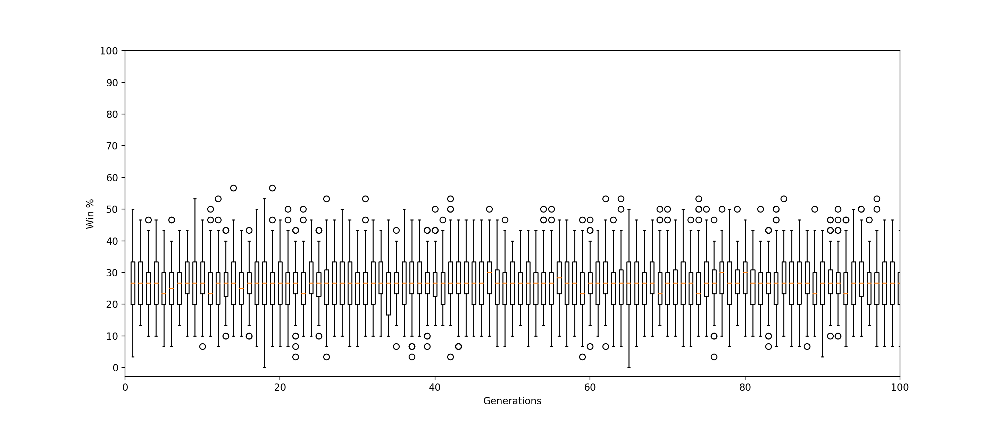
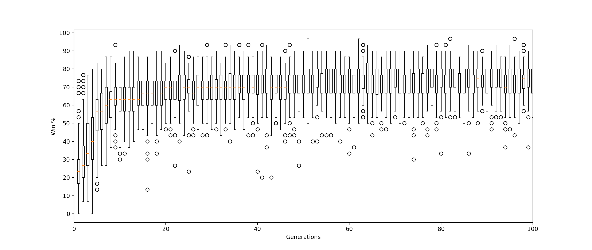

# LudoGA

An implementation of two different methods for creating an agent, that is capable of playing and winning in the game of Ludo. 

## Abstract 
In this paper a Genetic Algorithm (GA) is used to teach an AI agent to play Ludo. Two different methods are explored and com- pared on the basis of the GA; one where the GA learns the weights of a multilayered perceptron (MLP), and another where the GA evolves to arrive at the (locally) optimal weights in a State Transition Function (STF). Results show that the population in the GA arrives at a higher average win-rate of 75.3% with the STF compared to a win-rate of 29.0% using the MLP.

## Results
### **MLP**

### **STF**

## More info

For more information check the [paper](LudoGA_siesm17.pdf).